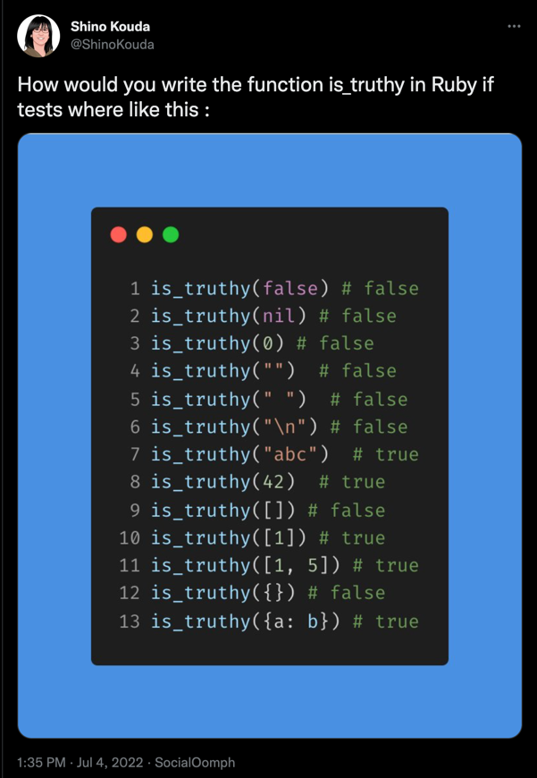

# Solution for is_truthy

Based on this [tweet](https://twitter.com/ShinoKouda/status/1543921321163341828) 


> 
> 

### Solution

> 

---

## Process

Install [Rubysmith](https://www.alchemists.io/projects/rubysmith/)

```bash
gem install rubysmith
```

_'Smith'_ the project

```bash
  rubysmith --build truthy_tool
```


Write the tests you need in `spec/truthy_tool_spec.rb`

```ruby
 require "spec_helper"

RSpec.describe TruthyTool do

  describe ".is_truthy??" do
    it { expect(described_class.is_truthy?(false)).to eq(false) } # false
    it { expect(described_class.is_truthy?(nil)).to eq(false) } # false
    it { expect(described_class.is_truthy?(0)).to eq(false) } # false
    it { expect(described_class.is_truthy?("")).to eq(false) } # false
    it { expect(described_class.is_truthy?("")).to eq(false) } # false
    it { expect(described_class.is_truthy?("\n")).to eq(false) } # false
    it { expect(described_class.is_truthy?("abc")).to eq(true)}  # true
    it { expect(described_class.is_truthy?(42)).to eq(true)}  # true
    it { expect(described_class.is_truthy?([])).to eq(false) } # false
    it { expect(described_class.is_truthy?([1])).to eq(true)}  # true
    it { expect(described_class.is_truthy?([1, 5])).to eq(true)}  # true
    it { expect(described_class.is_truthy?({})).to eq(false) } # false
    it { expect(described_class.is_truthy?({a: :b})).to eq(true)}  # true
    end
end
```

Run the tests
```bash
rspec .
```
       
Write the code in steps until all tests pass in `lib/truthy_tool.rb`

```ruby 
require "zeitwerk"

Zeitwerk::Loader.for_gem.setup

# Main namespace.
module TruthyTool
  module_function

  def is_truthy?(val)
    !(val.eql?(false) ||
      val.eql?(nil) ||
      val.eql?(0) ||
      val.eql?("") ||
      val.eql?("\n") ||
      val.eql?([]) ||
      val.eql?({}))
  end
end
```


